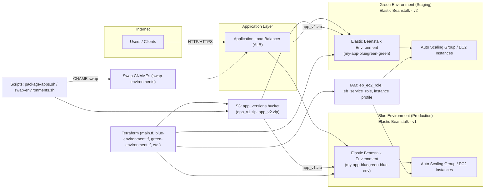

# Day 17 — Blue/Green Deployment Architecture Diagram

## Mermaid Diagram (paste into mermaid.live or VS Code Mermaid Preview) 🔧

---

## ASCII Diagram (quick view) ✅

Users --> ALB
          /   \
    Blue EB   Green EB
      |          |
    EC2 ASG    EC2 ASG

S3 (app_versions) --> Blue EB (app_v1.zip)
S3 (app_versions) --> Green EB (app_v2.zip)

Terraform manages: S3 bucket, EB application versions, EB environments, IAM roles, instance profile.
Scripts: `package-apps.sh` packages app-v1/app-v2 zips; `swap-environments.sh` swaps traffic by swapping CNAMEs.

---

## Files & Components 🔍
- Terraform files: `main.tf`, `blue-environment.tf`, `green-environment.tf`, `variables.tf`, `output.tf` (in `Day17_task`).
- Scripts: `package-apps.sh` (creates `app-v1/app-v1.zip`, `app-v2/app-v2.zip`), `swap-environments.sh` / `swap-environments.ps1`.
- App folders: `app-v1/`, `app-v2/` (contain `app.js`, `package.json`, and generated zips).
- AWS resources: Elastic Beanstalk application + 2 environments, S3 bucket for versions, IAM roles, ALB, EC2 instances in Auto Scaling groups.

---

## How to view/export the diagram 💡
- Quick: Open `architecture-diagram.md` in VS Code with the **Mermaid Markdown Preview** or **Markdown Preview Enhanced** extension.
- Online: paste the Mermaid code into https://mermaid.live to generate PNG/SVG.
- CLI export: `npx @mermaid-js/mermaid-cli -i diagram.mmd -o diagram.png` (create a `.mmd` file with the Mermaid block first).

---

If you want, I can also:
- generate a PNG of the diagram and add it to the repo, or
- add the diagram to `README.md` for Day17_task.

Tell me which export or placement you prefer. 
